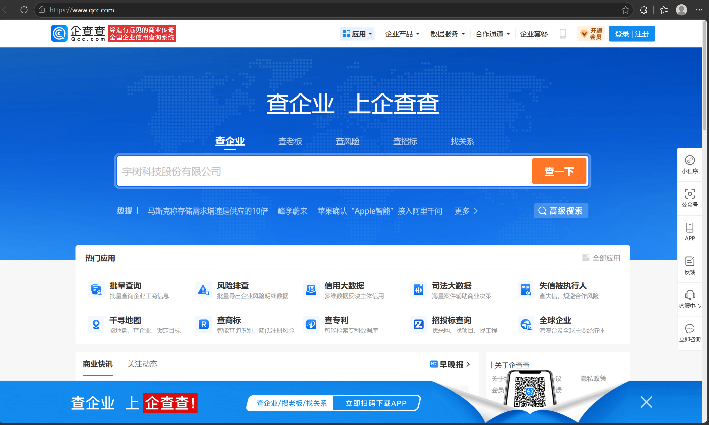

# 企业信息收集


## 1. 为什么需要企业信息收集

在进行信息收集时，我们通常只知道目标组织名称。

例如：

```
某某市某某单位
```

但是仅通过名称无法直接知道：

- 官方网站是什么
- 使用什么域名
- 是否存在关联组织
- 是否存在其他互联网入口


因此，需要通过企业公开信息确认目标主体，并寻找可能存在的互联网资产。


## 2. 企业信息收集目标

企业信息收集主要关注：

### 2.1 确认目标主体

获取：

- 企业/组织名称
- 注册信息
- 地址信息


目的：

确认当前目标是否为正确组织。


### 2.2 寻找官方网站

重点关注：

- 官方网站
- 官方域名


因为官方网站通常是后续资产收集的入口。


流程：

```
组织名称
↓
企业信息查询
↓
官方网站
↓
主域名
↓
子域名收集
```


### 2.3 发现关联组织

部分组织可能存在：

- 子公司
- 分支机构
- 关联单位


这些信息可以帮助发现可能存在的其他资产。


## 3. 企业信息收集工具


## 3.1 企查查


### 工具介绍

企查查是一类企业信息查询平台。

通过公开数据整合，可以查询企业相关信息。


工具链接：

https://www.qcc.com/





### 作用

在信息收集中，企查查主要用于：

- 确认目标主体
- 查询企业基础信息
- 获取官方网站
- 查看关联组织

### 企查查工具使用


直接搜索目标名称，可以看到目标的官网地址，邮箱等信息


其中官网信息最重要。

因为官网域名可以进入后续：

- 域名信息收集
- DNS查询
- 子域名发现

接着可以点进去查看关联信息，重点关注：关联企业，分支机构


注意：

关联企业不一定属于目标资产范围，需要后续确认。

### 工具原理


企业信息查询平台本质上是对公开数据进行整理和关联。


数据来源包括：

- 企业公开信息
- 工商信息
- 互联网公开数据


工具通过数据聚合，使我们能够快速确认目标组织。

## 4. 其他工具


除了企查查，还可以使用：

- 天眼查：https://www.tianyancha.com
- 爱企查：https://aiqicha.baidu.com
- 国家企业信用信息公示系统


这些工具作用类似，可以作为补充信息来源。


## 5. 总结


企业信息收集是被动信息收集阶段的重要入口。

通过企业信息查询工具，可以确认目标主体，并发现官方网站等互联网入口。

后续将围绕发现的域名继续进行：

- 域名信息收集
- DNS信息收集
- 资产发现
